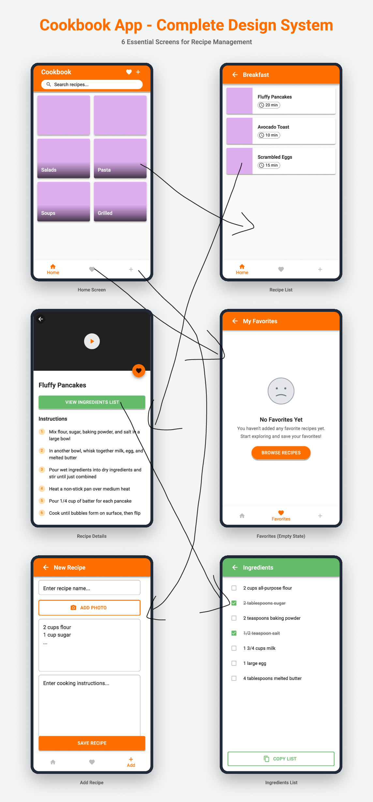
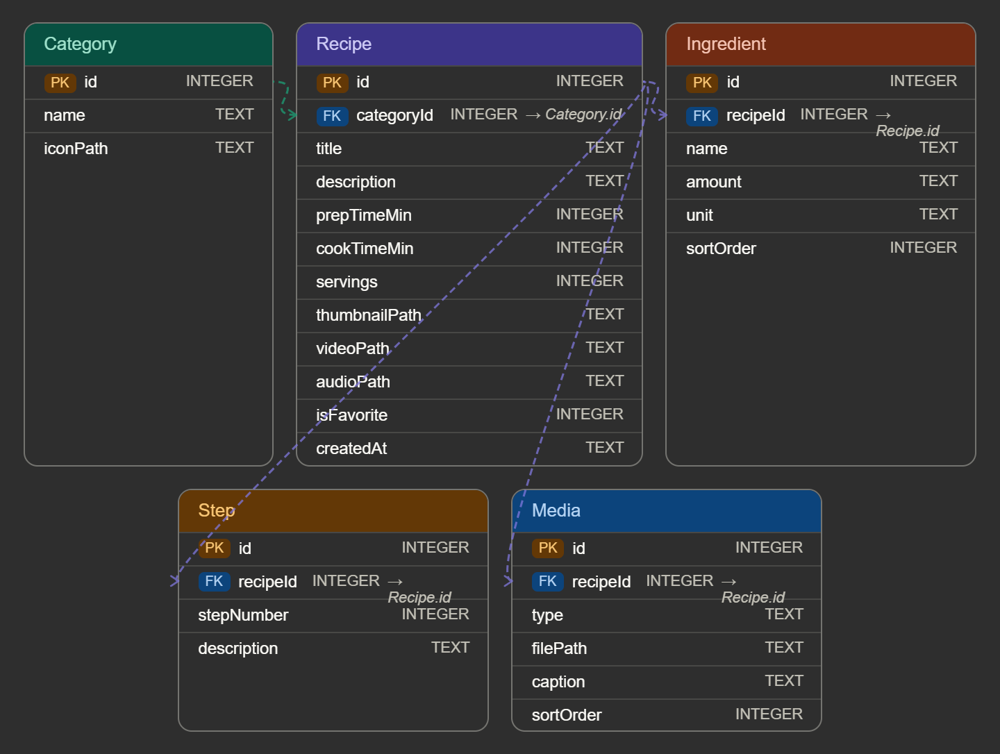

# CookM8

Aplikacja kulinarna na Androida zbudowana w Jetpack Compose, MVVM i Room.

---

## Funkcje

- **Przeglądanie po kategoriach** — siatka 2-kolumnowa kategorii z okładkami
- **Wyszukiwanie na żywo** — wyszukiwanie przepisów z debounce podczas pisania
- **Szczegóły przepisu** — galeria zdjęć do przesuwania, instrukcje krok po kroku, czas gotowania, porcje i ocena gwiazdkowa
- **Odtwarzacz wideo** — wbudowany ExoPlayer do filmów z przepisem
- **Odtwarzacz audio** — pasek z narracją audio z odtwarzaniem/pauzą/przewijaniem
- **Ekran składników** — lista z checkboxami i kopiowaniem do schowka jednym kliknięciem
- **Ulubione** — zapisywanie i zarządzanie ulubionymi przepisami
- **Dodaj przepis** — formularz do tworzenia przepisu ze zdjęciami i filmem z galerii
- **Import z aniagotuje.pl** — wklej link do przepisu, a formularz wypełni się automatycznie

---

## Ekrany

| Ekran | Opis |
|---|---|
| Strona główna | Siatka kategorii + wyszukiwanie przepisów |
| Lista przepisów | Wszystkie przepisy w wybranej kategorii |
| Szczegóły przepisu | Galeria, wideo, audio, instrukcje, dodawanie do ulubionych |
| Składniki | Lista składników z możliwością odhaczania i kopiowania |
| Ulubione | Zapisane przepisy |
| Dodaj przepis | Tworzenie przepisu ręcznie lub import z aniagotuje.pl |

---

## Stos technologiczny

| Warstwa | Technologia |
|---|---|
| UI | Jetpack Compose + Material 3 |
| Architektura | MVVM — `ViewModel` + `StateFlow` |
| Nawigacja | Navigation Compose z animacjami przejść |
| Baza danych | Room (lokalny SQLite) |
| Dependency Injection | Hilt |
| Ładowanie obrazów | Coil |
| Wideo / Audio | Media3 ExoPlayer |
| Parsowanie HTML | Jsoup (do importu przepisów) |

---

## Uruchomienie

**Wymagania:** Android Studio Ladybug (2024.2+), JDK 17, urządzenie lub emulator z API 26+

1. Sklonuj repozytorium i otwórz folder `CookM8/` w Android Studio
2. Poczekaj na synchronizację Gradle
3. Uruchom **Run** na podłączonym urządzeniu lub emulatorze

Baza danych uzupełnia się przykładowymi przepisami przy pierwszym uruchomieniu — żadna konfiguracja nie jest wymagana.

---

## Import przepisów

Na ekranie **Dodaj przepis** wklej dowolny link `aniagotuje.pl/przepis/…` i naciśnij **Importuj przepis**. Aplikacja pobiera stronę, parsuje tytuł, opis, składniki, instrukcje krok po kroku, czas gotowania, porcje i zdjęcia, a następnie wypełnia formularz automatycznie. Możesz wszystko przejrzeć i edytować przed zapisaniem.
